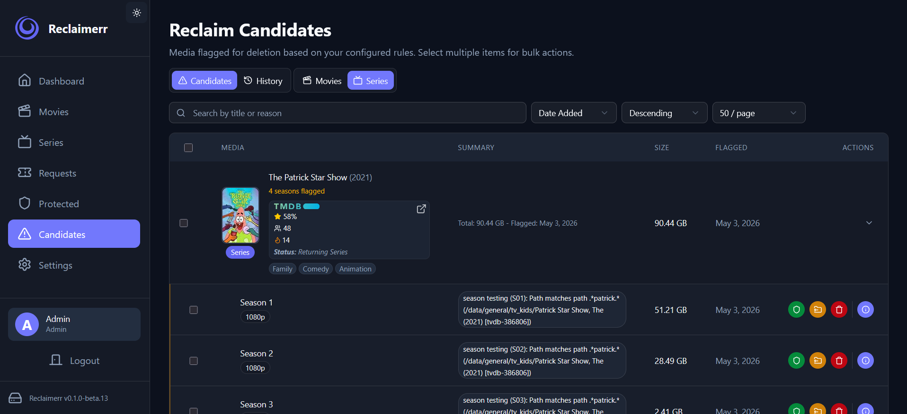
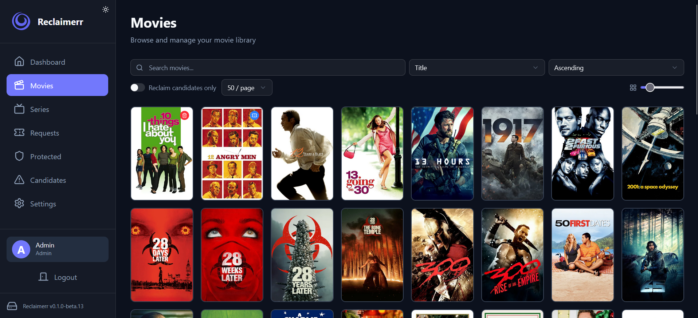
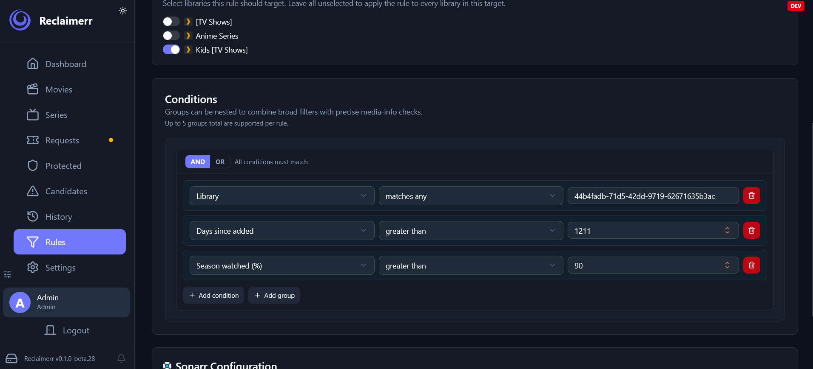
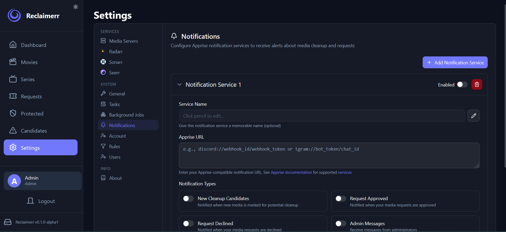
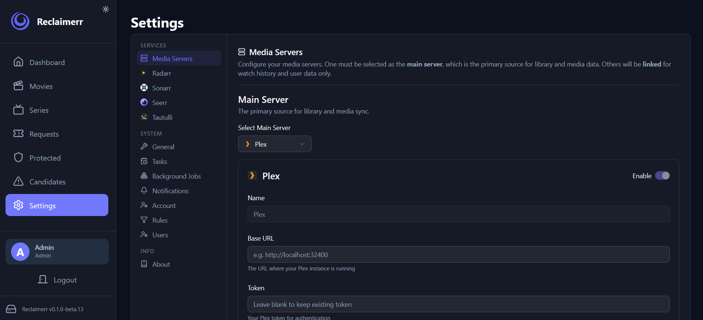
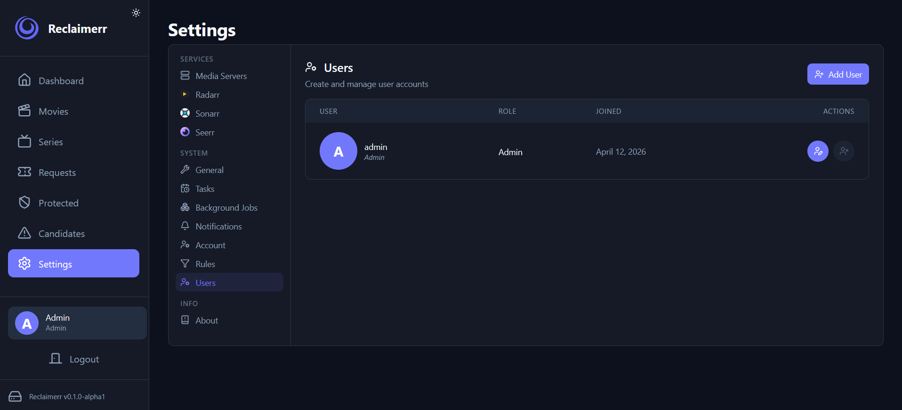
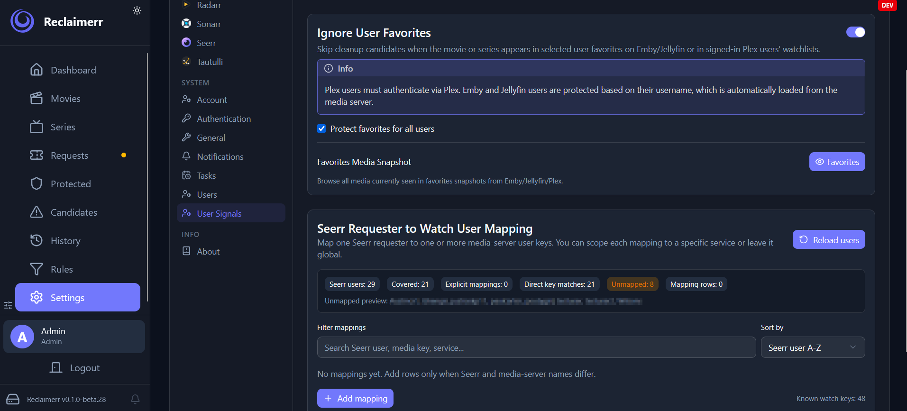

# MediaMasterr

    

    <strong>Visual Media Operations Platform</strong>

<picture></picture>
<picture></picture>
<picture></picture>
<picture></picture>

MediaMasterr correlates media servers, request systems, and protection rules into one media asset model. It does not replace Sonarr or Radarr. It answers a simpler question: what should I do next?

## What It Does

- Builds a visual media operations workspace for candidates, requests, and lifecycle actions.
- Unifies Jellyfin, Plex, Emby, Radarr, Sonarr, qBittorrent, and protection providers into a shared media model.
- Surfaces recommendations, priorities, and safe actions without forcing you into a single upstream tool.
- Supports Docker, desktop packaging, and release automation for production deployments.

## Architecture

MediaMasterr is split into a Python backend, a Svelte frontend, and release workflows that publish Docker images and desktop artifacts. The backend owns the media intelligence engine, the frontend renders operations and display profiles, and GitHub Actions produces the deployable artifacts.

## Getting Started

1. Read the [Quick Start](docs/getting-started/index.md).
2. Review [Docker deployment](docs/deployment/docker.md) if you plan to run in containers.
3. See [Contributing](docs/development/contributing.md) for local development guidance.

## Installation

MediaMasterr can be installed from source, from Docker, or via the desktop build. The recommended production path is Docker because it aligns with the release workflow and publishes immutable image tags for deployment tools like Dockge.

## Docker

The canonical image is published to GHCR on every successful `main` push.

- `ghcr.io/dutchgeek/mediamasterr:latest`
- `ghcr.io/dutchgeek/mediamasterr:<full-commit-sha>`

Use the workflow summary as the source of truth for the digest and build metadata.

## TrueNAS

For TrueNAS deployments, use the Docker image and point persistent volumes at the application data directories documented in the deployment guide.

## Dockge

Dockge can track the `latest` tag for convenience, or the full commit SHA for strict pinning. The release workflow publishes both so either deployment style is supported.

## Quick Start

1. Deploy the published Docker image.
2. Connect your media servers and request providers.
3. Review the Operations workspace to decide what should happen next.
4. Confirm the About page matches the expected commit SHA and workflow metadata.

## Screenshots

Current UI screenshots live in `docs/images/` and reflect the present MediaMasterr interface:

## Roadmap

- Continue hardening the release and deployment workflow.
- Expand the media intelligence engine with stronger recommendation context.
- Keep the visual design system consistent across all media surfaces.

## Contributing

Please read the development documentation before making changes. Keep PRs focused, validate locally, and make sure release-related changes are proven in GitHub Actions.

## License

MediaMasterr is licensed under GPL-3.0.

## Acknowledgements

MediaMasterr was originally derived from the Reclaimerr project. Internal compatibility and historical references remain where they are needed for upstream continuity or runtime compatibility.
