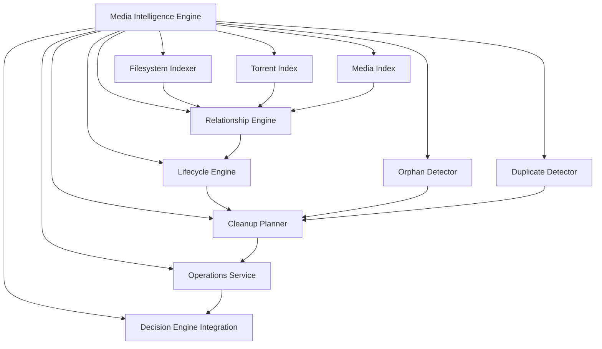

# Features

MediaMasterr is built around a predictable reclaim pipeline: scan, review,
protect, approve, then delete or move through the correct service.

## Core Workflow

- Sync media and metadata from Plex, Jellyfin, and Emby
- Scan for reclaim candidates using your configured rules
- Track candidate scopes at the item, series, season, and episode level
- Respect protection, pending requests, and deletion history
- Route deletions through the media server, Radarr, or Sonarr when possible

## Operational Features

| Feature | What It Gives You |
| --- | --- |
| Leaving Soon | A visible collection for items that are approaching removal |
| Scheduled tasks | Automated sync, scanning, and optional deletion workflows |
| Protection flow | Keep items out of deletion while a request is pending or approved |
| Reclaim history | Audit what happened, when it happened, and who approved it |
| Fallback deletion | Delete locally when a media server cannot handle the action |

## Safety Controls

- Automatic cleanup deletion is opt-in.
- Protected media is skipped by design.
- Pending protection requests and pending delete requests block deletion.
- Main-server-dependent tasks stay disabled until the main server is available.

## Supported Services

- Plex
- Jellyfin
- Emby
- Radarr
- Sonarr

## Media Intelligence Engine (MIE)

MediaMasterr v0.4 introduces a provider-agnostic intelligence layer that
correlates media, torrents, protection, and filesystem evidence into
recommendations that are explainable and safe.

### Operations Surface

The Operations workspace is lifecycle-first and visual-first.

- Kanban-style workflow lanes: Download, Import, Organize, Retention, Cleanup, Completed
- Poster-anchored asset cards with recommendation, confidence, risk, and recoverable space
- Shared workspace toolbar integration for ARR, decision, and smart filter context
- Stage-scoped filters and readiness views (ready, blocked, needs review)
- Sticky bulk-operations toolbar for Preview, Validate, and async Execute without route reloads
- Live execution progress with current asset, current step, elapsed time, ETA, and per-asset pipeline stages
- Targeted lane/card updates and persisted execution history summaries after bulk runs
- In-page side inspector for identity, relationship, policy, and recommendation context

The intelligence remains recommendation-driven, but operators can now execute in
batches without leaving the active workflow lane or losing selection context.

### Operations Intelligence Engine (Phase 2)

Operations now consumes the MIE correlation graph as its single intelligence
input. The Operations engine evaluates graph snapshots and produces:

- issue detections with severity, confidence, explainability reason, and graph evidence
- health categories and overall health score
- graph and timeline summaries for UI consumption
- recommendation payloads linked back to issue keys and graph references

This keeps Operations aligned with correlation logic and avoids rebuilding
provider-specific intelligence in multiple layers.

### Download Lifecycle Intelligence

Downloads are treated as transient working storage. Operations continuously
classifies indexed download objects and assigns one lifecycle state per object:

- active (`metadata_download`, `queued`, `downloading`, `checking`, `moving`, `seeding`)
- imported
- orphaned
- stale
- failed
- unknown

Each object is correlated with qBittorrent, ARR ownership, request lineage,
identity graph signals, and timeline evidence where available.

Operations exposes a Downloads Health section with:

- active downloads
- completed waiting for import
- completed waiting for cleanup
- imported but still present
- duplicate downloads
- failed downloads
- unknown downloads
- orphaned downloads
- safe-to-delete count
- total download space and recoverable space

### Correlation Engine (Phase 1)

MIE now provides a unified media-correlation graph per media item via
`GET /api/mie/media/{media_id}/graph`.

The graph correlates:

- canonical identity and external IDs
- request intelligence (Overseerr)
- ARR ownership (Radarr/Sonarr)
- torrent intelligence (computed MIE state)
- file intelligence (media/subtitle/nfo/artwork/extras)
- artwork references across providers
- timeline events and health categories

Provider contributions are modular. Each provider contributes independently, and
the correlation engine merges contributions into one stable API contract.

### Filesystem Access Modes

- Discovery: read-only visibility, no cleanup execution
- Assisted (default): read/write with explicit user approval per operation
- Automated: read/write with only approved rules eligible for auto execution

